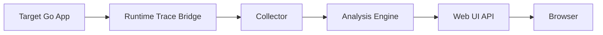

# Goroscope MVP Spec

## 1. Product Goal

`Goroscope` is a local developer tool for inspecting concurrency behavior in Go applications. The MVP must let an engineer run a Go program through a CLI wrapper, collect goroutine execution events, and inspect those events in a browser timeline.

Primary user outcomes:

- understand when goroutines are running, blocked, or waiting
- find long waits on channels and mutexes
- spot goroutines that never complete
- inspect a selected goroutine with current state and stack

MVP scope:

- local execution only
- single target process
- single user session
- no distributed tracing
- no production-grade persistence

Success criteria:

- developer can run `goroscope run ./cmd/app`
- browser UI opens at `http://localhost:7070`
- timeline displays goroutine state segments over time
- inspector shows goroutine metadata and latest stack snapshot
- tool remains usable on apps with up to `10k-20k` active goroutines in MVP mode

Note: the original target of `100,000 goroutines` is aspirational. For MVP it is a scalability target for later optimization, not an acceptance gate.

---

## 2. User Flow

### Main flow

```bash
goroscope run ./app
```

Execution flow:

1. CLI validates target package or binary path.
2. CLI starts the local collector and analysis engine.
3. CLI launches the target process with tracing enabled.
4. Agent/runtime bridge streams events to collector over localhost.
5. Collector normalizes events and forwards them to analysis engine.
6. Web UI opens or becomes available at `http://localhost:7070`.
7. User inspects timeline, filters goroutines, and opens inspector.

### Secondary flows

```bash
goroscope ui
goroscope collect
goroscope replay ./captures/sample.gtrace
```

`replay` is optional for MVP, but the event model should support it from the start.

---

## 3. MVP Boundaries

### In scope

- capturing goroutine lifecycle and blocking-related runtime events
- local collector over WebSocket
- in-memory event storage with bounded retention
- timeline UI
- goroutine inspector
- basic filtering by goroutine id, state, and text search

### Out of scope

- exact root-cause deadlock detection
- cluster or multi-process support
- continuous background profiling daemon
- scheduler CPU lane visualization
- automatic source-code annotation inside IDE
- full historical persistence across sessions

### Post-MVP direction

- VS Code extension as a thin client over local `goroscope` core

---

## 4. Architecture



### Architectural decision for MVP

The most realistic data source for MVP is `runtime/trace`, not invasive instrumentation of user code. `runtime/trace` already exposes goroutine scheduling and blocking behavior with enough fidelity for a first usable debugger.

Additional sources:

- `runtime/pprof.Lookup("goroutine")` for stack snapshots
- `runtime.Stack` for fallback stack capture

Non-MVP sources:

- custom compiler/plugin instrumentation
- eBPF
- patching mutex/channel operations in user code

---

## 5. Components

## 5.1 CLI

Responsibilities:

- parse commands and flags
- start local services
- launch target program
- pass configuration through environment variables
- optionally open browser

Key commands:

```bash
goroscope run [package-or-binary]
goroscope collect
goroscope ui
goroscope replay [capture-file]
```

Suggested flags:

```bash
--addr=127.0.0.1:7070
--collector-addr=127.0.0.1:7071
--no-browser
--sample-stacks=500ms
--buffer-mb=256
--session-name=my-run
```

## 5.2 Runtime Trace Bridge

Responsibilities:

- enable trace collection in target process
- decode or transform runtime trace events
- enrich stream with stack snapshots at controlled intervals
- send normalized events to collector

Implementation options:

1. Embedded bridge library linked into a launcher wrapper
2. Sidecar subprocess reading generated trace output

For MVP choose:

- launch target via `go test`/`go run`-style wrapper or compiled binary
- write raw trace to a local pipe/file
- decode and normalize into internal event schema

Constraint:

Attaching to an arbitrary already-running Go process is not required for MVP.

## 5.3 Collector

Responsibilities:

- receive normalized events over localhost
- validate event schema
- assign session id and sequence number
- buffer event stream
- publish events to UI clients

Transport for MVP:

- ingest: WebSocket or internal Go channel if same process
- UI push: WebSocket

Decision:

- if CLI/collector/ui run in one process, keep ingestion internal and expose only one browser WebSocket
- keep transport interface abstract so external agent transport can be added later

## 5.4 Analysis Engine

Responsibilities:

- map events into goroutine state intervals
- maintain latest state per goroutine
- compute waiting durations
- detect suspicious long-lived blocked goroutines
- provide query API for UI

Analysis outputs:

- timeline lanes
- goroutine summary table
- inspector payload
- channel/mutex interaction edges

## 5.5 Web UI

Responsibilities:

- render timeline for many goroutines
- support zoom, pan, selection
- show goroutine inspector
- show state legend and filters

Rendering decision:

- use `Canvas` for timeline lanes
- use React for state management and inspector/filter panels
- defer D3 unless graph layouts become necessary

---

## 6. Event Model

This is the core contract of the system. Runtime trace data is noisy and low-level, so the collector must normalize everything into a stable internal schema.

### 6.1 Base event schema

```json
{
  "session_id": "sess_01HR...",
  "seq": 1024,
  "ts_ns": 1710000012345678900,
  "kind": "goroutine.state",
  "goroutine_id": 42,
  "state": "BLOCKED",
  "reason": "chan_send",
  "resource_id": "chan:0xc000018230",
  "stack_id": "stk_a12f",
  "labels": {
    "function": "main.worker"
  }
}
```

### 6.2 Normalized event kinds

Required for MVP:

- `goroutine.create`
- `goroutine.start`
- `goroutine.state`
- `goroutine.end`
- `stack.snapshot`
- `resource.edge`

### 6.3 Goroutine states

Canonical states shown in UI:

- `RUNNING`
- `RUNNABLE`
- `WAITING`
- `BLOCKED`
- `SYSCALL`
- `DONE`

Mapping notes:

- channel wait and mutex wait should both surface as `BLOCKED`, differentiated by `reason`
- scheduler-ready state should map to `RUNNABLE`
- stack snapshots are asynchronous metadata, not state transitions

### 6.4 Blocking reasons

```text
chan_send
chan_recv
select
mutex_lock
rwmutex_rlock
rwmutex_lock
sync_cond
syscall
sleep
gc_assist
unknown
```

### 6.5 Resource identity

MVP rule:

- resource ids may be best-effort and process-local only
- channels and mutexes are identified by runtime address when available

Examples:

```text
chan:0xc000018230
mutex:0xc000014180
```

This is sufficient for a local debugging session even though names like `ch_jobs` are not reliably discoverable from runtime alone.

### 6.6 Stack snapshot schema

```json
{
  "session_id": "sess_01HR...",
  "seq": 1040,
  "ts_ns": 1710000012350000000,
  "kind": "stack.snapshot",
  "stack_id": "stk_a12f",
  "goroutine_id": 42,
  "frames": [
    {
      "func": "main.worker",
      "file": "/workspace/app/main.go",
      "line": 57
    }
  ]
}
```

### 6.7 Derived timeline segment

The UI should not rebuild lane segments from raw events on every frame. The analysis engine must emit pre-aggregated segments:

```json
{
  "goroutine_id": 42,
  "start_ns": 1710000012340000000,
  "end_ns": 1710000012355000000,
  "state": "BLOCKED",
  "reason": "chan_recv",
  "resource_id": "chan:0xc000018230"
}
```

---

## 7. Data Flow

### 7.1 Collection pipeline

1. trace source emits low-level runtime events
2. bridge decodes them into internal raw structs
3. normalizer maps raw events to canonical event kinds
4. analysis engine updates goroutine state machine
5. derived view models are published to the browser

### 7.2 Session lifecycle

1. session created by CLI
2. target process attached to session
3. events buffered in ring buffer
4. browser subscribes to session stream
5. session marked complete when process exits
6. session retained in memory for short post-run inspection

Retention defaults:

- raw events: bounded ring buffer
- stacks: deduplicated by `stack_id`
- completed sessions: last `3` sessions

---

## 8. Public API

MVP can keep UI/backend in one binary, but the API contract should still be explicit.

### 8.1 HTTP routes

| Method | Path | Purpose |
| --- | --- | --- |
| `GET` | `/` | serve UI |
| `GET` | `/api/v1/session/current` | current session metadata |
| `GET` | `/api/v1/goroutines` | paginated goroutine list |
| `GET` | `/api/v1/goroutines/:id` | goroutine inspector payload |
| `GET` | `/api/v1/timeline` | visible window timeline segments |
| `GET` | `/api/v1/resources/graph` | channel/mutex edges |
| `GET` | `/healthz` | health check |

### 8.2 WebSocket stream

`GET /api/v1/stream`

Browser receives:

- `session.started`
- `timeline.append`
- `goroutine.updated`
- `session.completed`

Example:

```json
{
  "type": "goroutine.updated",
  "payload": {
    "goroutine_id": 42,
    "state": "WAITING",
    "reason": "chan_recv",
    "wait_ns": 230000000
  }
}
```

### 8.3 Inspector response

```json
{
  "goroutine_id": 42,
  "state": "WAITING",
  "reason": "chan_recv",
  "resource_id": "chan:0xc000018230",
  "wait_ns": 230000000,
  "created_ns": 1710000010000000000,
  "last_seen_ns": 1710000012350000000,
  "last_stack": {
    "frames": [
      {
        "func": "main.worker",
        "file": "/workspace/app/main.go",
        "line": 57
      }
    ]
  }
}
```

---

## 9. Repository Structure

```text
goroscope/
├── cmd/
│   └── goroscope/
│       └── main.go
├── internal/
│   ├── cli/
│   │   └── run.go
│   ├── session/
│   │   └── manager.go
│   ├── tracebridge/
│   │   ├── source.go
│   │   ├── decoder.go
│   │   └── normalizer.go
│   ├── collector/
│   │   ├── collector.go
│   │   └── buffer.go
│   ├── analysis/
│   │   ├── engine.go
│   │   ├── state_machine.go
│   │   └── graph.go
│   ├── api/
│   │   ├── http.go
│   │   └── ws.go
│   └── model/
│       ├── event.go
│       ├── goroutine.go
│       ├── resource.go
│       └── timeline.go
├── web/
│   ├── package.json
│   ├── src/
│   │   ├── app.tsx
│   │   ├── timeline/
│   │   ├── inspector/
│   │   ├── filters/
│   │   └── api/
│   └── dist/
├── captures/
├── docs/
│   └── MVP_SPEC.md
├── go.mod
├── Makefile
└── README.md
```

Reasoning:

- `tracebridge` is separated from `analysis` because decoding runtime trace and building product semantics are different concerns
- `model` holds transport-safe contracts used by collector, API, and UI serialization
- `captures/` allows replay support without redesigning storage later

---

## 10. Phase 2: VS Code Extension

The VS Code extension is not a replacement for the local backend. It is an IDE client for the existing `goroscope` core.

### 10.1 Role of the extension

The extension should:

- discover Go targets inside the current workspace
- launch `goroscope run` for the selected target
- connect to local API and WebSocket stream
- render timeline and inspector in a VS Code webview
- open source files from stack frames

The extension should not:

- decode runtime trace itself
- store large event streams itself
- implement the goroutine state machine itself
- depend on VS Code APIs for core analysis logic

### 10.2 Integration model

Recommended model:

1. extension checks whether local `goroscope` binary is available
2. extension starts `goroscope run ... --addr 127.0.0.1:7070 --no-browser`
3. local core starts collector, analysis engine, and HTTP/WS API
4. extension webview connects to the same API used by standalone browser UI
5. stack frame clicks call VS Code APIs to open file and line

This keeps one source of truth for collection and analysis logic.

### 10.3 Extension UX

Initial commands:

- `Goroscope: Run Current Package`
- `Goroscope: Run Selected Main`
- `Goroscope: Attach to Current Goroscope Session`
- `Goroscope: Stop Session`

Initial UI surfaces:

- activity bar icon for Goroscope
- session panel with run status
- webview timeline tab
- goroutine inspector side panel

### 10.4 Extension requirements

- works on local workspaces only in first version
- assumes `goroscope` binary is installed or built in workspace
- shows a clear error if backend binary is missing
- reconnects if webview reloads while session is still active

### 10.5 API dependency

The extension must consume the same contracts as the browser UI:

- `GET /api/v1/session/current`
- `GET /api/v1/goroutines/:id`
- `GET /api/v1/timeline`
- `GET /api/v1/resources/graph`
- `GET /api/v1/stream`

No extension-specific backend protocol should be introduced in the first iteration.

### 10.6 Delivery order

The extension starts only after standalone CLI + browser UI are working.

Phase order:

1. finish standalone MVP
2. stabilize API contracts
3. extract shared UI client code if needed
4. implement VS Code extension as a thin shell

---

## 11. UI Requirements

## 11.1 Timeline

Must support:

- one horizontal lane per goroutine
- color-coded state segments
- time-axis zoom and pan
- click-to-select goroutine
- virtualized rendering for large lane counts

Colors:

- `RUNNING`: green
- `RUNNABLE`: gray
- `WAITING`: yellow
- `BLOCKED`: red
- `SYSCALL`: blue
- `DONE`: dark gray

## 11.2 Inspector

Must display:

- goroutine id
- current state
- blocking reason
- resource id
- current wait duration
- latest stack
- first seen / last seen timestamps

## 11.3 Resource Graph

MVP version:

- simple node-edge graph or tabular edge list
- channel and mutex edges only
- no force-directed heavy visualization required

---

## 12. Non-Functional Requirements

### Performance

- collection overhead target: `<10% CPU` on representative local workloads
- timeline update latency target: `<500ms` from event ingestion to UI update
- browser remains interactive with `10k` visible goroutines using virtualization

### Memory

- default in-memory budget: `256MB`
- configurable upper bound: `1GB`
- stacks deduplicated aggressively

### Reliability

- collector must not crash on malformed event
- session completion must be handled even if target exits abruptly
- UI must tolerate stream reconnects

### Security

- bind to localhost by default
- no remote access in MVP
- no telemetry in MVP

---

## 13. Risks and Constraints

### Runtime limitations

Go runtime trace does not provide perfect semantic naming for channels or mutexes. The MVP must accept resource identifiers based on addresses and reasons rather than human-friendly names.

### Volume risk

Raw trace event volume can explode under high concurrency. The normalizer must support sampling or lossy retention for non-critical metadata before the browser path becomes saturated.

### Stack capture cost

Frequent full stack snapshots are expensive. Snapshotting must be rate-limited and optionally disabled.

### Compatibility

Target support should initially be limited to a documented minimum Go version. Do not promise broad runtime compatibility before verifying trace format assumptions.

---

## 14. Delivery Plan

## Phase 1. Event Model and Core Domain

Deliverables:

- canonical event schema in `internal/model`
- goroutine state machine
- test fixtures for normalized events

Acceptance:

- given ordered events, engine builds correct state intervals
- blocked/wait durations are computed correctly

## Phase 2. Trace Bridge and Collector

Deliverables:

- runtime trace ingestion
- event normalization pipeline
- bounded event buffer

Acceptance:

- target process can be launched and observed
- session receives create/start/state/end events

## Phase 3. HTTP API and WebSocket Stream

Deliverables:

- REST endpoints
- live browser stream
- session lifecycle management

Acceptance:

- browser can subscribe and receive live updates during run

## Phase 4. UI Timeline and Inspector

Deliverables:

- timeline canvas renderer
- inspector panel
- filtering controls

Acceptance:

- user can inspect at least `1k` goroutines comfortably on a laptop

## Phase 5. Packaging and Replay

Deliverables:

- stable CLI UX
- captured session replay
- README and demo app

Acceptance:

- a recorded session can be reopened without rerunning target

## Phase 6. VS Code Extension

Deliverables:

- VS Code extension scaffold
- command palette integration
- webview timeline client
- open-in-editor from stack frame

Acceptance:

- developer can run a Go target from VS Code
- timeline is visible inside the IDE
- clicking a stack frame opens the source file at the correct line

---

## 15. Definition of Done for MVP

MVP is done when all conditions hold:

- `goroscope run ./app` starts a traced local session
- UI is reachable at `http://localhost:7070`
- timeline shows goroutine state transitions over time
- inspector shows state, wait reason, and stack
- system survives target process exit without hanging
- core logic has automated tests for event normalization and state transitions

---

## 16. Immediate Next Steps

Recommended order:

1. implement `internal/model/event.go` and `internal/analysis/state_machine.go`
2. build a fake event generator to unblock UI before real runtime trace integration
3. implement collector + REST/WS contracts
4. build timeline UI against fake data
5. replace fake generator with real trace bridge

This order reduces integration risk and lets UI/API progress before the hardest runtime integration is complete.
