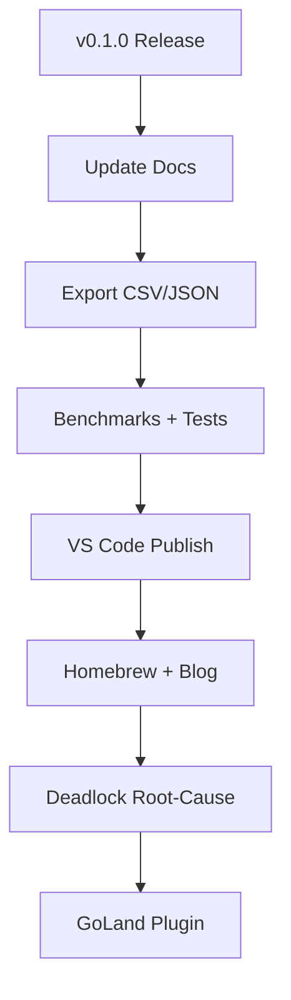

# Goroscope Product Roadmap

План развития продукта с учётом исследования инструментария для Go-разработчиков (Go Developer Survey 2025, GitHub issues, анализ конкурентов).

---

## Контекст: исследование рынка

### Боли Go-разработчиков (Survey 2025, 5 379 респондентов)

| Боль | % | Релевантность для Goroscope |
|-----|---|----------------------------|
| Best practices / идиоматичность | 33% | Косвенно: Goroscope как пример качественного Go-модуля |
| Отсутствие фич из других языков | 28% | — |
| Поиск надёжных модулей | 26% | Публикация, качество, adoption |
| Документация `go` subcommands | 15–25% | — |

### Ограничения `go tool trace` (golang/go#33322, #76849)

- Загрузка всего трейса в память, нет стриминга
- Большие файлы (3.5 GB+) — зависания, OOM
- ~1M событий — падения Chrome
- Нет экспорта в JSON/CSV для внешнего анализа
- Внутренний парсер, нельзя переиспользовать

### Ниши с недостаточным tooling

1. **Визуализация горутин** — альтернатив `go tool trace` почти нет
2. **Частичный deadlock** — runtime видит только «все спят»
3. **Goroutine leak detection** — отдельного инструмента нет
4. **Экспорт трейсов** — нет удобного формата для pandas/Perfetto
5. **IDE-интеграция** — timeline в IDE редок

---

## Приоритет 1: Подготовка к первому релизу

### 1.1 Выпустить v0.1.0

- Создать тег `v0.1.0` и запушить — release workflow соберёт бинарники
- Обновить [CHANGELOG.md](../CHANGELOG.md): переименовать `[Unreleased]` в `[0.1.0]`

### 1.2 Обновить документацию

- [REACT_UI_ROADMAP.md](REACT_UI_ROADMAP.md): таблица «Отсутствует» устарела — все пункты реализованы
- [MVP_SPEC.md](MVP_SPEC.md) §16 «Immediate Next Steps» — устаревший, обновить или удалить

---

## Приоритет 2: Product-Market Fit (исследование)

### 2.1 Экспорт для анализа (golang/go#33322)

Разработчики просят экспорт в pandas/CSV. Добавить:

- `goroscope export --format=csv` — таблица сегментов (goroutine_id, state, start_ns, end_ns, reason, stack_id)
- `goroscope export --format=json` — расширить текущий JSON (уже есть Export JSON в UI)
- Документация: примеры анализа в Python/pandas

### 2.2 Zero-friction onboarding

Текущий flow требует `agent.StartFromEnv()`. Варианты:

- Поддержка `go test -trace` — загрузка трейса из теста без agent
- `goroscope trace <binary>` — обёртка над `go test -trace` для произвольного бинарника (сложнее)

### 2.3 Улучшенный deadlock detection

`goroscope check` даёт hints. Углубить:

- Root-cause: граф блокировок, циклы
- Интеграция с `go-deadlock` (опционально)

---

## Приоритет 3: Качество и надёжность

### 3.1 Benchmarks в CI

Добавить в CI:

```yaml
- name: Benchmarks
  run: go test -bench=. -benchmem -count=1 ./internal/tracebridge/... ./internal/analysis/...
```

### 3.2 Frontend-тесты

- Vitest + @testing-library/react
- Smoke-тесты для Filters, Inspector, Timeline
- `npm run test` в CI

### 3.3 Расширить Go-тесты

- [internal/cli](internal/cli) — тесты команд
- [internal/api](internal/api) — handleReplayLoad, handleGoroutineStackAt

---

## Приоритет 4: Распространение и доверие (Survey: 26% — поиск модулей)

### 4.1 VS Code Extension Marketplace

- Open VSX (open-source)
- Visual Studio Marketplace (Azure DevOps)

### 4.2 Homebrew

- `brew install goroscope` — формула для macOS

### 4.3 Quality signals

- README: badges (go report card, coverage)
- pkg.go.dev: документация, примеры
- Блог/туториал: «Debugging Go concurrency with Goroscope»

---

## Приоритет 5: Post-MVP фичи

| Фича | Сложность | Связь с исследованием |
|------|-----------|------------------------|
| **GMP scheduler lanes** | Средняя | API есть; визуализация CPU/proc |
| **Memory budget** | Низкая | NFR: 1GB, bounded retention |
| **Goroutine leak hints** | Средняя | Ниша: отдельного инструмента нет |
| **Persistence** | Высокая | Вне MVP |

---

## Приоритет 6: IDE и редакторы (Survey: VS Code 37%, GoLand 28%)

### 6.1 GoLand plugin

- Аналог VS Code extension
- Timeline webview, open-in-editor

### 6.2 Cursor/Zed (по 4% каждый)

- Ранние пользователи; проверить совместимость VS Code extension

---

## Рекомендуемый порядок



1. **Сейчас**: v0.1.0, обновить docs
2. **Краткосрочно**: export для анализа, benchmarks, frontend tests
3. **Среднесрочно**: VS Code publish, Homebrew, туториал
4. **Долгосрочно**: deadlock root-cause, GMP lanes, GoLand
